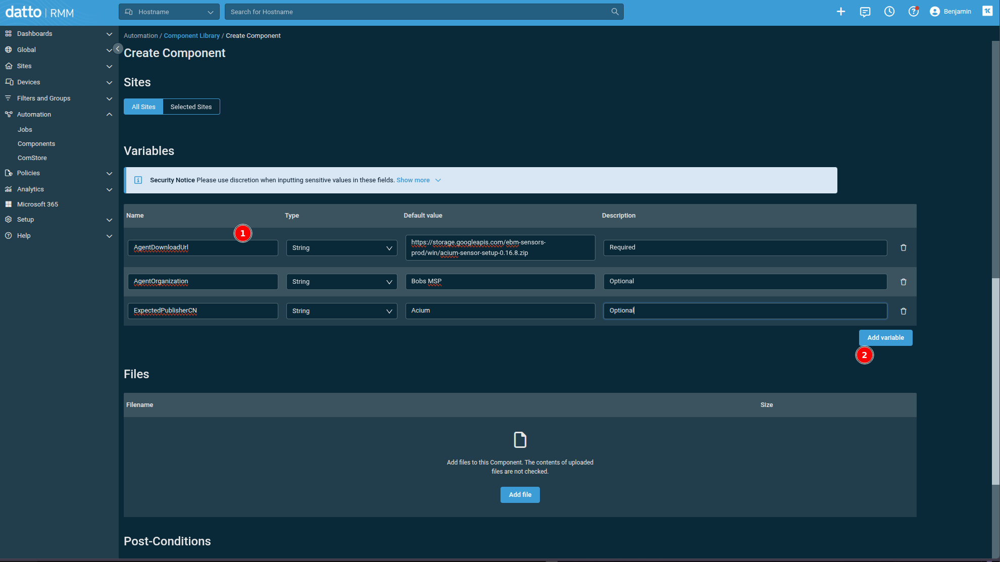
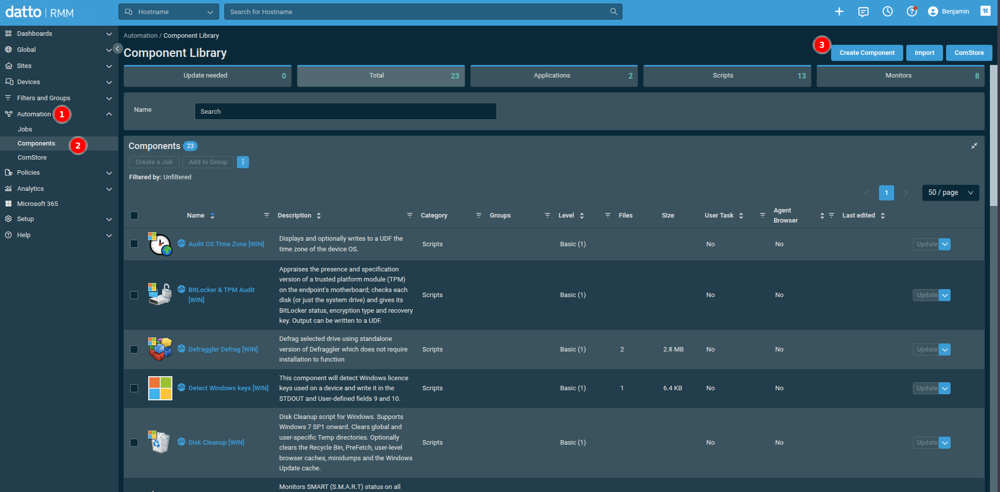
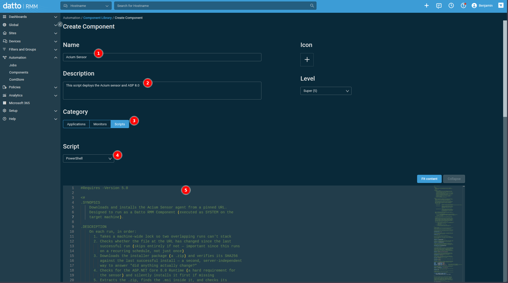
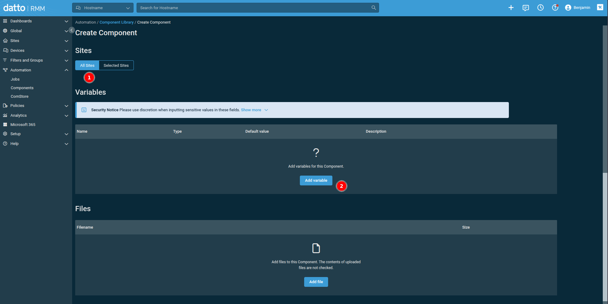
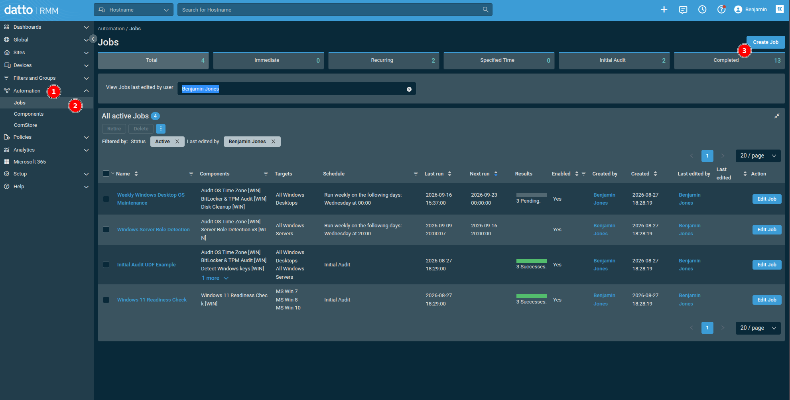
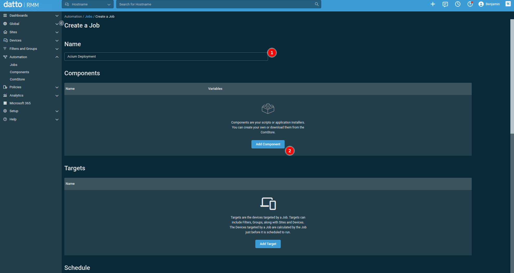
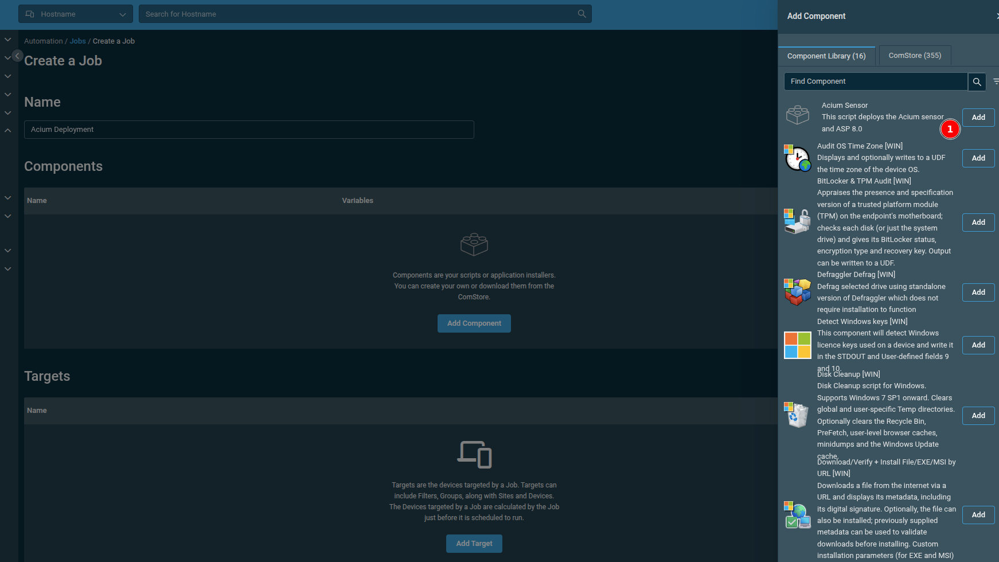
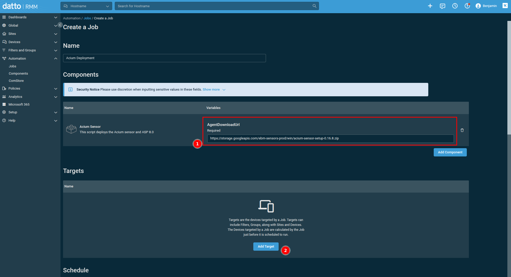
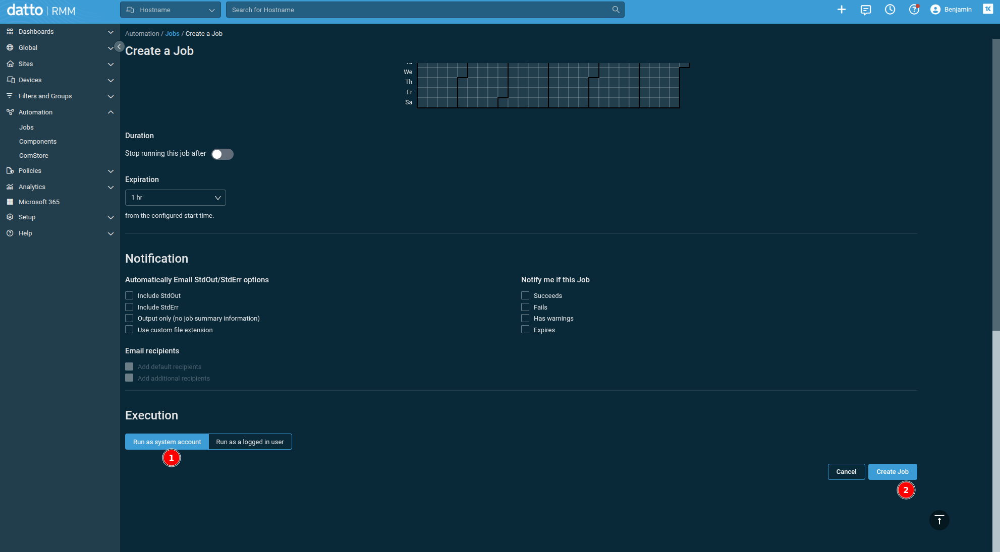
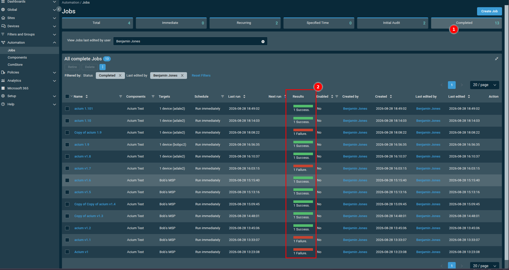

# Acium Sensor — Datto RMM Deployment Script

This folder contains `dattormm-acium.ps1`, a PowerShell script that installs and keeps the Acium Sensor up to date across a fleet of Windows endpoints via Datto RMM.

It's designed to run as a **recurring Datto RMM Component**, safely skipping machines that are already up to date and only reinstalling when something's actually changed.

## What the script does

On each run, in order:

1. **Takes a machine-wide lock** so an overlapping run (a slow previous run plus a new scheduled trigger, or a manual run stacked on a scheduled one) can't run twice at once.
2. **Checks whether anything's changed** — compares the source file's ETag (a fingerprint from the download server) against what was saved from the last successful run, *and* checks whether the `AciumSensor` Windows service is present (not just whether its process happens to be running right now). Only skips the rest of the script if both say "nothing to do."
3. **Downloads** the sensor package (a `.zip`) and hashes it (SHA256) as a second, server-independent change check, in case the server ever stops sending an ETag.
4. **Checks for the ASP.NET Core 8.0 Runtime** — a hard requirement for the sensor to run. If it's missing, silently installs Microsoft's official Hosting Bundle before doing anything else. If that install needs a reboot, the script defers the sensor install to the next scheduled run rather than installing against a runtime that can't start yet.
5. **Extracts** the `.zip`, locates `AciumSensorInstall.msi` inside it, and checks its Authenticode signature.
6. **Installs** the MSI silently via `msiexec`, correctly distinguishing a first-time install from a reinstall (see Known dependencies below for why that distinction matters), and verifies afterward that the sensor is actually present.
7. **Cleans up** downloaded files and records the new ETag/SHA256 for next time — only after a verified successful install.

The script is intended to be idempotent and safe to run on a schedule — a machine that's already current will do almost nothing (a quick network check, then exit).

## Prerequisites

- Datto RMM agent installed and checking in on target endpoints.
- Endpoints running Windows with PowerShell 5.1 (Windows PowerShell, not PowerShell Core) — this is what Datto RMM Components run under by default.
- Outbound HTTPS access from endpoints to your sensor package's download URL and to `aka.ms` (for the ASP.NET Core Runtime installer, only needed on machines that don't already have it).

## Setup in Datto RMM

### 1. Create a new Component

In Datto RMM, go to **Automation > Component Library**, and click **Create Component** in the top right.

### 2. Fill in the Component details

Give it a **Name** and, optionally, a **Description**. Set **Category** to **Scripts**, and change the **Script** dropdown to **PowerShell**. Paste the contents of `dattormm-acium.ps1` into the script body below.

Scrolling down, set **Sites** to **All Sites** (unless you specifically want this Component scoped to only certain sites), then click **Add variable**.

### 3. Add the Component Variables

This script reads its configuration from **Component Variables**:

| Variable name | Type | Required | Example value |
|---|---|---|---|
| `AgentDownloadUrl` | String | Yes | `https://storage.googleapis.com/ebm-sensors-prod/win/acium-sensor-setup-0.16.8.zip` |
| `AgentOrganization` | String | No | Your org/tenant ID, passed to the MSI as the `ORGANIZATION` property |
| `ExpectedPublisherCN` | String | No | Expected Authenticode signer subject CN, e.g. `Acium, Inc.` — when set, an MSI not validly signed by it is refused |

> Bumping to a new sensor version later is just updating `AgentDownloadUrl` — you don't need to edit the script itself.

Save the Component once these are in place.

### 4. Create a recurring Job

Execution context (System vs. logged-on user) isn't set on the Component itself — it's set per-Job, in the last step below.

**a.** Go to **Automation > Jobs**, and click **Create Job**.

**b.** Give the Job a **Name**, then click **Add Component**.

**c.** In the panel that opens, find the Component you created (e.g. "Acium Sensor") and click **Add**.

**d.** Confirm/override the Component's variable value(s) for this Job — at minimum, `AgentDownloadUrl` — then add your **Targets** (devices, sites, filters, or groups).

**e.** Scroll down to **Schedule** and set it to run on a recurring basis (e.g. daily). Under **Execution**, choose **Run as system account** (not "Run as a logged in user"), then click **Create Job**.

Because the script checks for changes before doing any real work, recurring execution is cheap — most runs will be a quick no-op. A completed Job's **Results** column shows a quick green/red rollup per run; drill into an individual run for full stdout if something failed.

## Logs

The script writes its own logs to the endpoint, independent of what Datto RMM captures:

| File | What's in it |
|---|---|
| `C:\ProgramData\AciumSensor\Logs\deploy.log` | The script's own step-by-step log — what it checked, downloaded, and decided on each run. |
| `C:\ProgramData\AciumSensor\Logs\msi-install.log` | Windows Installer's verbose log for the actual MSI install — useful for diagnosing install failures. |
| `C:\ProgramData\AciumSensor\Install\last-installed.json` | Small state file recording the ETag and SHA256 of the last successfully installed package, used for the change check. |

If a deployment isn't behaving as expected, `deploy.log` is the first place to look — it logs which account it's running as, the ETag comparison result, whether the ASP.NET Core Runtime was found, and the final `msiexec` exit code.

## Exit codes

| Code | Meaning |
|---|---|
| `0` | Success — installed, already up to date (no-op), or deferred pending a reboot (see the log for which) |
| `1` | Download failed (sensor package or ASP.NET Core Runtime installer) |
| `3` | Install failed (sensor MSI or ASP.NET Core Runtime installer) |
| `4` | Missing or invalid Component Variable (`AgentDownloadUrl` empty, or `AgentOrganization` contains a double quote) |
| `5` | Zip extracted successfully, but `AciumSensorInstall.msi` wasn't found inside it |
| `6` | MSI failed Authenticode signature verification against `ExpectedPublisherCN` |

Datto RMM surfaces these in the job/dashboard results, so a quick glance tells you whether a failure was a network issue, a missing variable, or an actual install problem.

## Known dependencies

- **ASP.NET Core 8.0 Runtime** is required for the sensor service to start. The script checks for and installs this automatically, but it does add extra time (and a download) the first time it runs on any given machine. Subsequent runs skip this once the runtime is present.
- The sensor's `.zip` package must contain a file named exactly `AciumSensorInstall.msi` — the script searches for this filename specifically.

## Troubleshooting

- **UAC prompt appears on the client**: This shouldn't happen if the Component is genuinely running as System — SYSTEM-context execution never triggers UAC. If you see this, first confirm the Component's execution context, then check `deploy.log`'s `Running as:` line to see what account actually ran the script.
- **Install seems to succeed but the sensor doesn't run**: Check whether the ASP.NET Core 8.0 Runtime installed successfully in `deploy.log`, and confirm via `Get-Service AciumSensor` on the endpoint. If the runtime is present and the service still isn't there, check `msi-install.log` for the `Feature: Main; ... Action:` line — if it says `Action: Null` for every component (instead of `Action: Local`), Windows Installer silently did nothing (see the exit-code-3/1638 entry below for why, and confirm you're running a version of this script with the ProductState check — older copies always passed `REINSTALL=ALL` and could hit exactly this).
- **Script always reinstalls, never skips**: Check that the download URL returns an `ETag` header (most servers, including Google Cloud Storage, do this by default) and that `last-installed.json` is being written and persisted between runs.
- **Install fails with exit code 3 and `msi-install.log` shows error 1638 ("Another version of this product is already installed")**: The sensor's MSI keeps the same `ProductCode` across versions, so Windows Installer refuses a plain reinstall whenever that `ProductCode` is already registered — most commonly because the sensor was installed manually at some point (outside this script), so there's no `last-installed.json` to make the script skip it. The script now checks whether the product is already installed via Windows Installer's own `ProductState` API and only adds `REINSTALL=ALL REINSTALLMODE=vomus` in that case — those properties are needed to force a reinstall over an existing registration, but must NOT be passed on a genuine first-time install: doing so makes Windows Installer resolve every component's install action to `Null`, silently installing nothing while still reporting exit code 0. If you still see 1638, confirm the deployed script includes the `ProductState` check (look for `$isProductInstalled` in SECTION 8) rather than an older copy that always passed those properties.
- **Script exits 0 but nothing was installed and the log says "deferred"**: The ASP.NET Core Hosting Bundle needed a reboot to finish. This is expected — the script intentionally stops rather than installing the sensor against a runtime that can't start yet. The next scheduled run completes the install once the machine has rebooted.
